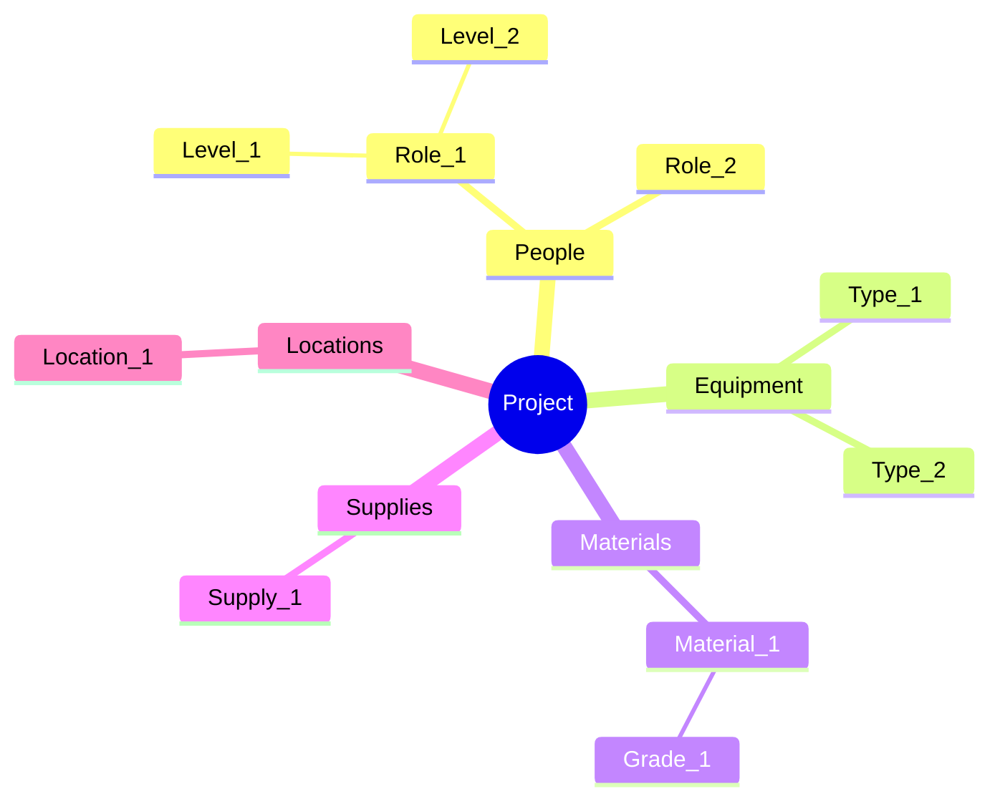

<!-- LLM INSTRUCTIONS: Fill in the Resource Breakdown Structure based on the project context.

Section Instructions:
*   **Resource Breakdown Structure (Outline):** Provide a hierarchical outline of resources organized by type and category. Use the following numbering structure:
    1. Project
    1.1. People
        1.1.1. Quantity of Role 1
            1.1.1.1. Quantity of Level 1
    1.2. Equipment
    1.3. Materials
    1.4. Supplies
    1.5. Locations
*   **Hierarchical Chart:** Provide a Mermaid mindmap or flowchart TD representing the resource breakdown structure visually.
-->

<h3 align="right">{{Company_Name}}</h3>
<h2 align="right">{{Project_Name}} - {{Project_ID}}</h2>
<h1 align="center">RESOURCE BREAKDOWN STRUCTURE</h1>

| **Date Prepared:** {{Current_Date}} | **Project Manager:** {{Project_Manager_Name}} | **Prepared By:** {{Prepared_By}} |
| :--- | :--- | :--- |  

---

### Resource Breakdown Structure (Outline)
* 1. **[ Project Name ]**
  * 1.1. **People**
    * 1.1.1. [ Quantity ] of [ Role 1 ]
      * 1.1.1.1. [ Quantity ] of [ Level 1 ]
      * 1.1.1.2. [ Quantity ] of [ Level 2 ]
      * 1.1.1.3. [ Quantity ] of [ Level 3 ]
    * 1.1.2. [ Quantity ] of [ Role 2 ]
  * 1.2. **Equipment**
    * 1.2.1. [ Quantity ] of [ Type 1 ]
    * 1.2.2. [ Quantity ] of [ Type 2 ]
  * 1.3. **Materials**
    * 1.3.1. [ Quantity ] of [ Material 1 ]
      * 1.3.1.1. [ Quantity ] of [ Grade 1 ]
      * 1.3.1.2. [ Quantity ] of [ Grade 2 ]
  * 1.4. **Supplies**
    * 1.4.1. [ Quantity ] of [ Supply 1 ]
    * 1.4.2. [ Quantity ] of [ Supply 2 ]
  * 1.5. **Locations**
    * 1.5.1. [ Location 1 ]
    * 1.5.2. [ Location 2 ]

---

### Resource Breakdown Structure (Hierarchical Chart)

---

### Signatures

| Prepared By: | Reviewed By: | Approved By: |
| :--- | :--- | :--- |
| **Name:** {{Prepared_By}} | **Name:** {{Reviewed_By}} | **Name:** {{Approved_By}} |
| **Signature:** _____________________ | **Signature:** _____________________ | **Signature:** _____________________ |
| **Date:** _________________ | **Date:** _________________ | **Date:** _________________ |

---

  <strong>Template:</strong> RESOURCE BREAKDOWN STRUCTURE | <strong>Ref:</strong> PMO-04.06.03  
  <i>Generated on: {{Current_Timestamp}}, by <a href="https://github.com/fakhruldeen/Tasleemat/" style="color: #7f8c8d;">Tasleemat</a></i>

