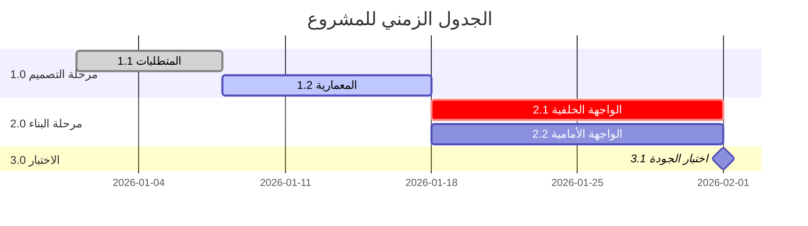

<!-- تعليمات للنموذج الذكي: قم بتعديل مخطط جانت المرئي (Mermaid Gantt) لتمثيل الجدول الزمني للمشروع. تأكد من صحة بناء الجملة (Syntax).

تعريف الأعمدة:
*   **مُعرّف هيكل تجزئة العمل :** الرمز الفريد الذي يربط النشاط بحزمة العمل.
*   **اسم النشاط:** وصف موجز للعمل.
*   **تاريخ البدء:** تاريخ البدء المخطط (YYYY-MM-DD).
*   **تاريخ الانتهاء:** تاريخ الانتهاء المخطط (YYYY-MM-DD).
*   **اسم المورد:** الشخص أو الدور المعين للنشاط.
-->

<h3 align="left">{{اسم_الشركة}}</h3>
<h2 align="left">{{اسم_المشروع}} - {{معرف_المشروع}}</h2>
<h1 align="center">الجدول الزمني للمشروع</h1>

| **تاريخ الإعداد:** {{التاريخ_الحالي}} | **مدير المشروع:** {{اسم_مدير_المشروع}} | **إعداد:** {{معد_الوثيقة}} |
| ---: | ---: | ---: |  

---

---

### بيانات الجدول الزمني
| مُعرّف هيكل تجزئة العمل  | اسم النشاط | تاريخ البدء | تاريخ الانتهاء | اسم المورد |
| ---: | ---: | ---: | ---: | ---: |
| [ أضف... ] | [ أضف... ] | [ أضف... ] | [ أضف... ] | [ أضف... ] |
| [ أضف... ] | [ أضف... ] | [ أضف... ] | [ أضف... ] | [ أضف... ] |
| [ أضف... ] | [ أضف... ] | [ أضف... ] | [ أضف... ] | [ أضف... ] |

---

### الاعتماد والموافقات

| الدور | الاسم | التوقيع | التاريخ |
| ---: | ---: | ---: | ---: |
| **مدير المشروع** | {{اسم_مدير_المشروع}} | _______________________ | [ .... - .... - .... ] |
| **مسؤول التخطيط / الجدولة** | {{اسم_مسؤول_التخطيط}} | _______________________ | [ .... - .... - .... ] |
| **راعي المشروع / العميل** | {{اسم_راعي_المشروع}} | _______________________ | [ .... - .... - .... ] |

---

  <strong>النموذج:</strong> الجدول الزمني للمشروع | <strong>المرجع:</strong> PMO-04.03.08  
  <i>تاريخ الإنشاء: {{وقت_الإنشاء}}, بواسطة <a href="https://github.com/fakhruldeen/Tasleemat/" style="color: #7f8c8d;">تسليمات</a></i>

