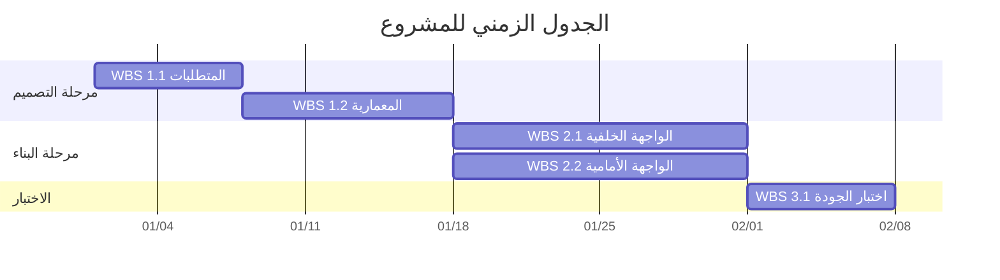

<!-- تعليمات للنموذج الذكي: قم بتعديل مخطط جانت المرئي (Mermaid Gantt) لتمثيل الجدول الزمني للمشروع. تأكد من صحة بناء الجملة (Syntax). -->

<h3 align="left">{{اسم_الشركة}}</h3>
<h2 align="left">{{اسم_المشروع}} - {{معرف_المشروع}}</h2>
<h1 align="center">الجدول الزمني للمشروع</h1>

| **تاريخ الإعداد:** {{التاريخ_الحالي}} | **مدير المشروع:** {{اسم_مدير_المشروع}} | **إعداد:** {{معد_الوثيقة}} |
| :--- | :--- | :--- |  

---

---

### التوقيعات

| تم الإعداد بواسطة: | تمت المراجعة بواسطة: | تم الاعتماد بواسطة: |
| :--- | :--- | :--- |
| **الاسم:** {{معد_الوثيقة}} | **الاسم:** {{مُراجع_الوثيقة}} | **الاسم:** {{معتمد_الوثيقة}} |
| **التوقيع:** _____________________ | **التوقيع:** _____________________ | **التوقيع:** _____________________ |
| **التاريخ:** _________________ | **التاريخ:** _________________ | **التاريخ:** _________________ |

---

  <strong>النموذج:</strong> الجدول الزمني للمشروع | <strong>المرجع:</strong> PMO-04.03.08  
  <i>تاريخ الإنشاء: {{وقت_الإنشاء}}, بواسطة <a href="https://github.com/fakhruldeen/Tasleemat/" style="color: #7f8c8d;">تسليمات</a></i>

