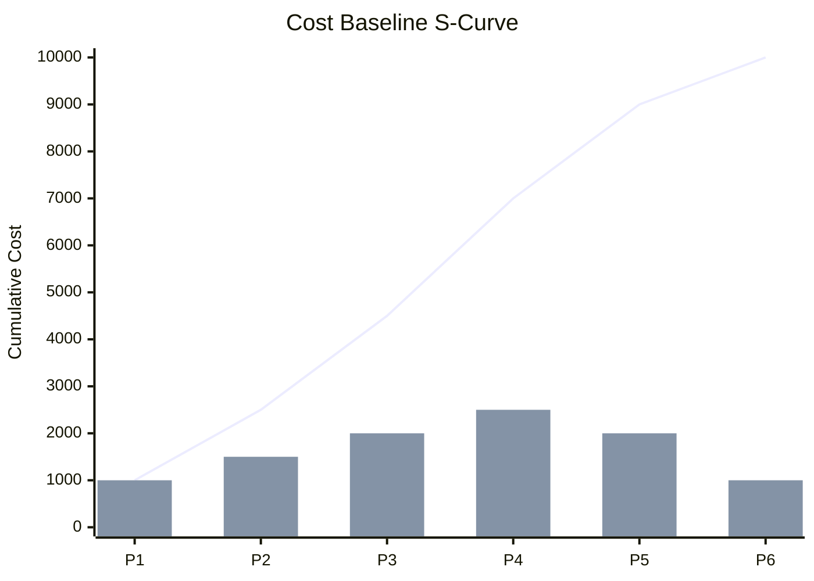

<!-- تعليمات للنموذج الذكي: قم بملء ملخص الميزانية وجدول الميزانية الموزعة زمنياً أدناه. قم بإنشاء مخطط xychart-beta من mermaid يمثل منحنى S للخط المرجعي للتكلفة.

تعليمات الأقسام:
*   **مكون الميزانية:** العنصر الهيكلي للميزانية (تقديرات تكلفة النشاط، احتياطي الطوارئ، الخط المرجعي للتكلفة، احتياطي الإدارة، الميزانية الإجمالية للمشروع).
*   **المبلغ:** إجمالي الأموال المخصصة لذلك المكون.
*   **الفترة الزمنية:** الفترة الزمنية المحددة (مثل الشهر الأول، الربع الأول).
*   **التكلفة المخططة للفترة:** التكلفة المخطط إنفاقها خلال هذه الفترة.
*   **التكلفة التراكمية:** الإجمالي التراكمي للتكاليف المخططة حتى هذه الفترة (يمثل منحنى S).
*   **ملاحظات / الأنشطة الرئيسية:** حزم العمل الرئيسية أو التسليمات التي تقود التكلفة في هذه الفترة.
*   **مخطط منحنى S:** قم بتحديث مخطط xychart-beta. يجب أن يكون المحور السيني x-axis عبارة عن أحرف إنجليزية قصيرة (مثل [P1, P2]) لتجنب أخطاء الترميز. المحور الصادي هو التكلفة التراكمية.
-->

<h3 align="left">{{اسم_الشركة}}</h3>
<h2 align="left">{{اسم_المشروع}} - {{معرف_المشروع}}</h2>
<h1 align="center">الخط المرجعي للتكلفة</h1>

| **تاريخ الإعداد:** {{التاريخ_الحالي}} | **مدير المشروع:** {{اسم_مدير_المشروع}} | **إعداد:** {{معد_الوثيقة}} |
| ---: | ---: | ---: |  

---

### ملخص ميزانية المشروع
<!-- يتضمن الخط المرجعي للتكلفة احتياطيات الطوارئ. يتم إضافة احتياطيات الإدارة إلى الخط المرجعي لتحديد الميزانية الإجمالية للمشروع. -->
| مكون الميزانية | المبلغ |
| ---: | ---: |
| **تقديرات تكلفة النشاط** | [ أضف التفاصيل... ] |
| **احتياطي الطوارئ** | [ أضف التفاصيل... ] |
| **الخط المرجعي للتكلفة (الإجمالي)** | [ أضف التفاصيل... ] |
| **احتياطي الإدارة** | [ أضف التفاصيل... ] |
| **الميزانية الإجمالية للمشروع** | [ أضف التفاصيل... ] |

---

### منحنى S للخط المرجعي للتكلفة
<!-- استبدل البيانات النموذجية أدناه بالتكاليف التراكمية الفعلية الموزعة زمنياً لرسم منحنى S. -->

---

### الميزانية الموزعة زمنياً
| الفترة الزمنية | التكلفة المخططة للفترة | التكلفة التراكمية | ملاحظات / الأنشطة الرئيسية |
| ---: | ---: | ---: | ---: |
| [ أضف التفاصيل... ] | [ أضف التفاصيل... ] | [ أضف التفاصيل... ] | [ أضف التفاصيل... ] |
| [ أضف التفاصيل... ] | [ أضف التفاصيل... ] | [ أضف التفاصيل... ] | [ أضف التفاصيل... ] |
| [ أضف التفاصيل... ] | [ أضف التفاصيل... ] | [ أضف التفاصيل... ] | [ أضف التفاصيل... ] |

---

### التوقيعات

| تم الإعداد بواسطة: | تمت المراجعة بواسطة: | تم الاعتماد بواسطة: |
| ---: | ---: | ---: |
| **الاسم:** {{معد_الوثيقة}} | **الاسم:** {{مُراجع_الوثيقة}} | **الاسم:** {{معتمد_الوثيقة}} |
| **التوقيع:** _____________________ | **التوقيع:** _____________________ | **التوقيع:** _____________________ |
| **التاريخ:** &nbsp;&nbsp;&nbsp;&nbsp;/&nbsp;&nbsp;&nbsp;&nbsp;/&nbsp;&nbsp;&nbsp;&nbsp;&nbsp;&nbsp;&nbsp;&nbsp; | **التاريخ:** &nbsp;&nbsp;&nbsp;&nbsp;/&nbsp;&nbsp;&nbsp;&nbsp;/&nbsp;&nbsp;&nbsp;&nbsp;&nbsp;&nbsp;&nbsp;&nbsp; | **التاريخ:** &nbsp;&nbsp;&nbsp;&nbsp;/&nbsp;&nbsp;&nbsp;&nbsp;/&nbsp;&nbsp;&nbsp;&nbsp;&nbsp;&nbsp;&nbsp;&nbsp; |

---

  <strong>النموذج:</strong> الخط المرجعي للتكلفة | <strong>المرجع:</strong> PMO-04.04.04  
  <i>تاريخ الإنشاء: {{وقت_الإنشاء}}, بواسطة <a href="https://github.com/fakhruldeen/Tasleemat/" style="color: #7f8c8d;">تسليمات</a></i>

