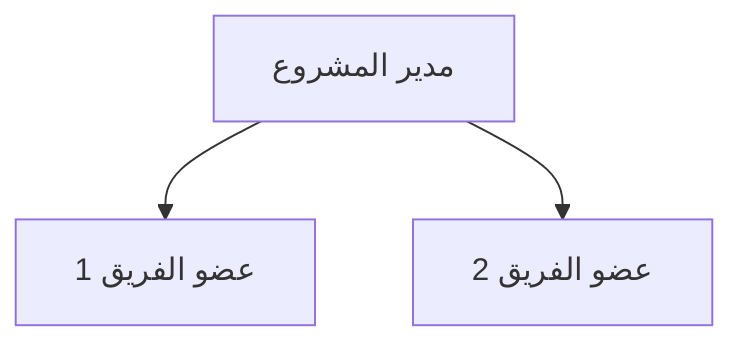

<!-- تعليمات للنموذج الذكي: قم بملء خطة إدارة الموارد بناءً على سياق المشروع.

تعليمات الأقسام:
*   **تحديد أعضاء الفريق:** الطرق المستخدمة لتحديد مجموعات المهارات اللازمة ومستوى المهارة.
*   **اكتساب أعضاء الفريق:** قم بتوثيق كيفية جلب الموظفين إلى المشروع. صف الاختلافات بين الأعضاء الداخليين والمقاولين الخارجيين.
*   **إدارة أعضاء الفريق:** وثق كيفية إدارة وتسريح الفريق، بما في ذلك نقل المعرفة.
*   **الهيكل التنظيمي للمشروع:** قم بإنشاء مخطط هيكلي (مخطط Mermaid) لإظهار التقارير والهيكل التنظيمي.
*   **الأدوار والمسؤوليات:** تقديم معلومات حول الدور، الصلاحيات، المسؤولية، المؤهلات، والكفاءات.
*   **متطلبات التدريب:** صف أي تدريب مطلوب وتوقيته.
*   **المكافآت والتقدير:** صف عمليات المكافآت والتقدير.
*   **تطوير الفريق:** صف طرق تطوير الفريق والأفراد.
*   **تحديد الموارد المادية:** الطرق المستخدمة لتحديد المواد والمعدات والإمدادات.
*   **اكتساب الموارد المادية:** توثيق كيفية الحصول عليها (شراء، استئجار).
*   **إدارة الموارد المادية:** توثيق كيفية إدارتها (المخزون، سلسلة التوريد).
-->

<h3 align="left">{{اسم_الشركة}}</h3>
<h2 align="left">{{اسم_المشروع}} - {{معرف_المشروع}}</h2>
<h1 align="center">خطة إدارة الموارد</h1>

| **تاريخ الإعداد:** {{التاريخ_الحالي}} | **مدير المشروع:** {{اسم_مدير_المشروع}} | **إعداد:** {{معد_الوثيقة}} |
| :--- | :--- | :--- |  

---

## 1. إدارة موارد الفريق

### 1.1 تحديد أعضاء الفريق
> [ أضف التفاصيل... ]

### 1.2 اكتساب أعضاء الفريق
> [ أضف التفاصيل... ]

### 1.3 إدارة أعضاء الفريق
> [ أضف التفاصيل... ]

---

## 2. الهيكل التنظيمي للمشروع

---

## 3. الأدوار والمسؤوليات
| الدور | الصلاحيات | المسؤولية | المؤهلات | الكفاءات |
| :--- | :--- | :--- | :--- | :--- |
| [ أضف التفاصيل... ] | [ أضف التفاصيل... ] | [ أضف التفاصيل... ] | [ أضف التفاصيل... ] | [ أضف التفاصيل... ] |
| [ أضف التفاصيل... ] | [ أضف التفاصيل... ] | [ أضف التفاصيل... ] | [ أضف التفاصيل... ] | [ أضف التفاصيل... ] |

---

## 4. تطوير ودعم الفريق

### 4.1 متطلبات التدريب
> [ أضف التفاصيل... ]

### 4.2 المكافآت والتقدير
> [ أضف التفاصيل... ]

### 4.3 تطوير الفريق
> [ أضف التفاصيل... ]

---

## 5. إدارة الموارد المادية

### 5.1 تحديد الموارد المادية
> [ أضف التفاصيل... ]

### 5.2 اكتساب الموارد المادية
> [ أضف التفاصيل... ]

### 5.3 إدارة الموارد المادية
> [ أضف التفاصيل... ]

---

### التوقيعات

| تم الإعداد بواسطة: | تمت المراجعة بواسطة: | تم الاعتماد بواسطة: |
| :--- | :--- | :--- |
| **الاسم:** {{معد_الوثيقة}} | **الاسم:** {{مُراجع_الوثيقة}} | **الاسم:** {{معتمد_الوثيقة}} |
| **التوقيع:** _____________________ | **التوقيع:** _____________________ | **التوقيع:** _____________________ |
| **التاريخ:** _________________ | **التاريخ:** _________________ | **التاريخ:** _________________ |

---

  <strong>النموذج:</strong> خطة إدارة الموارد | <strong>المرجع:</strong> PMO-04.06.01  
  <i>تاريخ الإنشاء: {{وقت_الإنشاء}}, بواسطة <a href="https://github.com/fakhruldeen/Tasleemat/" style="color: #7f8c8d;">تسليمات</a></i>

