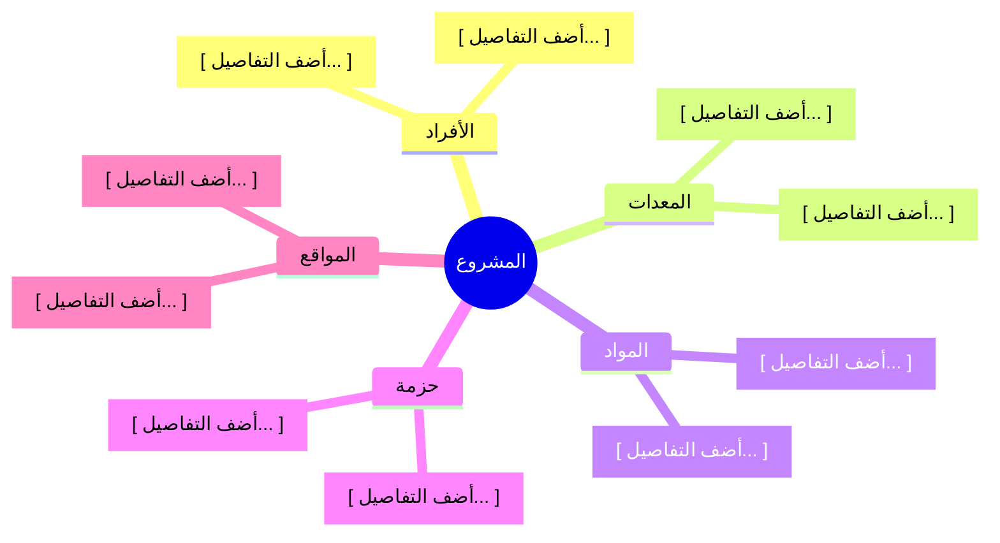

<!-- تعليمات النموذج الذكي: املأ هيكل تجزئة الموارد بناءً على سياق المشروع.

تعريف وسياق:
هيكل تجزئة الموارد بنية هرمية تنظم الموارد حسب النوع والفئة. ويمكن أن يظهر
كرسم هرمي أو كمخطط. وهو ناتج عن عملية تقدير موارد الأنشطة، وحقوله تتبع النطاق:
النطاق الثابت يعطي بنية موارد ثابتة، والنطاق المتغير يعطي بنية تُراجع كلما
تغير النطاق.

يستقبل من:
*  سجل الافتراضات
*  خطة إدارة الموارد
*  خط الأساس للنطاق
*  سمات الأنشطة

يقدم معلومات إلى:
*  ورقة عمل تقدير المدة

ملاحظات التخصص:
*  قسم فرع الأفراد إلى فروع أبعد عندما يخلط المشروع بين مستويات المهارة
  والشهادات المطلوبة والمواقع، فالفرع الذي يجمع الثلاثة لا يمكن تقديره ضد
  أي شيء.
*  نظم البنية حسب الجغرافيا بدل النوع عندما يتوزع العمل على مواقع متعددة
  وكان القيد هو مكان الأفراد.
*  أبق الترقيم متصلًا، فالفجوة في الرموز تقرأ كعقدة مفقودة لا كتخطيط متعمد.

المحاذاة:
يجب أن يتسق هيكل تجزئة الموارد مع:
*  خطة إدارة الموارد
*  متطلبات الموارد

توجيهات استيفاء الأقسام:
*  1. المخطط: اكتب التسلسل الهرمي صفوفًا من الرمز ومن البند. الرمز هو الموقع
  في البنية، ويُكتب 1 أو 1.1 أو 1.1.1 ليقرأ القارئ البنية من النص وحده.
*  2. الهيكل الهرمي: اذكر ما هو الرسم، ثم اكتب تسميات البنود بالترتيب نفسه
  الذي في المخطط. والرسم والتسميات يجب أن يتطابقا.
-->

<h3 dir="rtl" align="left">{{اسم_الشركة}}</h3>
<h2 dir="rtl" align="left">{{اسم_المشروع}} - {{معرف_المشروع}}</h2>
<h1 dir="rtl" align="center">هيكل تجزئة الموارد</h1>

| **تاريخ الإعداد:** {{التاريخ_الحالي}} | **مدير المشروع:** {{اسم_مدير_المشروع}} | **إعداد:** {{معد_الوثيقة}} |
| ---: | ---: | ---: |

---

## 1. المخطط

| رمز التجزئة | عقدة المورد |
| ---: | ---: |
| 1 | [ أضف التفاصيل... ] |
| 1.1 | الأفراد |
| 1.1.1 | [ أضف التفاصيل... ] |
| 1.1.2 | [ أضف التفاصيل... ] |
| 1.2 | المعدات |
| 1.2.1 | [ أضف التفاصيل... ] |
| 1.3 | المواد |
| 1.3.1 | [ أضف التفاصيل... ] |
| 1.4 | حزمة |
| 1.4.1 | [ أضف التفاصيل... ] |
| 1.5 | المواقع |
| 1.5.1 | [ أضف التفاصيل... ] |

## 2. الهيكل الهرمي

**النوع:** [ أضف التفاصيل... ]

**التسمية:**
[ أضف التفاصيل... ]

### الاعتماد والموافقات

| الدور | الاسم | التوقيع | التاريخ |
| ---: | ---: | ---: | ---: |
| **مدير المشروع** | {{اسم_مدير_المشروع}} | _______________________ | [.... -.... -.... ] |
| **مدير الموارد** | {{اسم_مدير_الموارد}} | _______________________ | [.... -.... -.... ] |
| **مسؤول مكتب إدارة المشاريع** | {{اسم_مسؤول_مكتب_إدارة_المشاريع}} | _______________________ | [.... -.... -.... ] |
---

 <strong>النموذج:</strong> هيكل تجزئة الموارد | <strong>المرجع:</strong> PMO-04.06.03  
 <i>تاريخ الإنشاء: {{وقت_الإنشاء}}, بواسطة <a href="https://github.com/fakhruldeen/Tasleemat/" style="color: #7f8c8d;">تسليمات</a></i>

