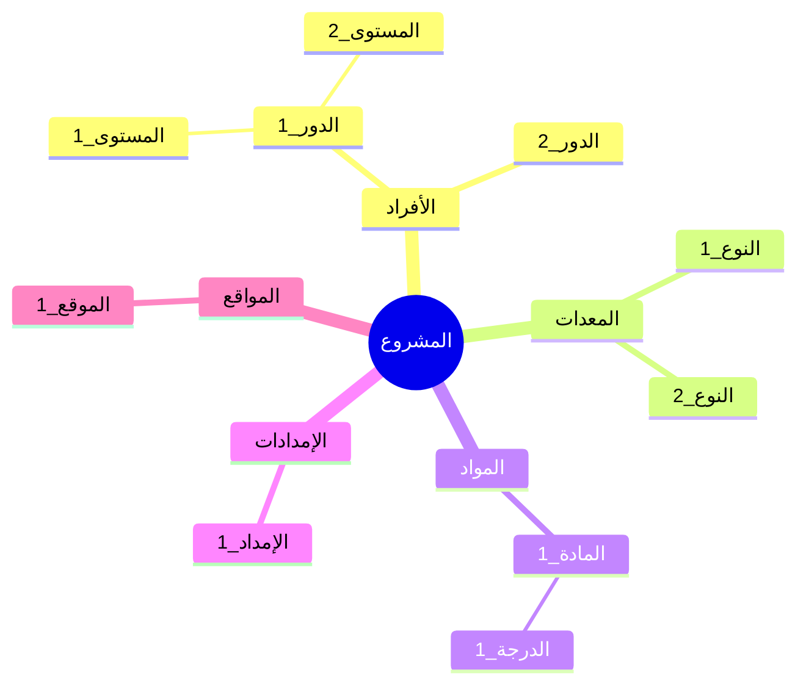

<!-- تعليمات للنموذج الذكي: قم بملء هيكل تجزئة الموارد بناءً على سياق المشروع.

تعليمات الأقسام:
*   **هيكل تجزئة الموارد (مخطط تفصيلي):** قم بتوفير مخطط هرمي للموارد منظماً حسب النوع والفئة. استخدم هيكل الترقيم التالي:
    1. المشروع
    1.1. الأفراد
        1.1.1. كمية الدور 1
            1.1.1.1. كمية المستوى 1
    1.2. المعدات
    1.3. المواد
    1.4. الإمدادات
    1.5. المواقع
*   **المخطط الهرمي:** قم بتوفير مخطط ذهني (Mermaid mindmap) أو مخطط انسيابي يمثل هيكل تجزئة الموارد بصرياً.
-->

<h3 align="left">{{اسم_الشركة}}</h3>
<h2 align="left">{{اسم_المشروع}} - {{معرف_المشروع}}</h2>
<h1 align="center">هيكل تجزئة الموارد</h1>

| **تاريخ الإعداد:** {{التاريخ_الحالي}} | **مدير المشروع:** {{اسم_مدير_المشروع}} | **إعداد:** {{معد_الوثيقة}} |
| ---: | ---: | ---: |  

---

### هيكل تجزئة الموارد (مخطط تفصيلي)
1. **[ اسم المشروع ]**
   1.1. **الأفراد**
      1.1.1. [ الكمية ] من [ الدور 1 ]
         1.1.1.1. [ الكمية ] من [ المستوى 1 ]
         1.1.1.2. [ الكمية ] من [ المستوى 2 ]
         1.1.1.3. [ الكمية ] من [ المستوى 3 ]
      1.1.2. [ الكمية ] من [ الدور 2 ]
   1.2. **المعدات**
      1.2.1. [ الكمية ] من [ النوع 1 ]
      1.2.2. [ الكمية ] من [ النوع 2 ]
   1.3. **المواد**
      1.3.1. [ الكمية ] من [ المادة 1 ]
         1.3.1.1. [ الكمية ] من [ الدرجة 1 ]
         1.3.1.2. [ الكمية ] من [ الدرجة 2 ]
   1.4. **الإمدادات**
      1.4.1. [ الكمية ] من [ الإمداد 1 ]
      1.4.2. [ الكمية ] من [ الإمداد 2 ]
   1.5. **المواقع**
      1.5.1. [ الموقع 1 ]
      1.5.2. [ الموقع 2 ]

---

### هيكل تجزئة الموارد (المخطط الهرمي)

---

### التوقيعات

| تم الإعداد بواسطة: | تمت المراجعة بواسطة: | تم الاعتماد بواسطة: |
| ---: | ---: | ---: |
| **الاسم:** {{معد_الوثيقة}} | **الاسم:** {{مُراجع_الوثيقة}} | **الاسم:** {{معتمد_الوثيقة}} |
| **التوقيع:** _____________________ | **التوقيع:** _____________________ | **التوقيع:** _____________________ |
| **التاريخ:** _________________ | **التاريخ:** _________________ | **التاريخ:** _________________ |

---

  <strong>النموذج:</strong> هيكل تجزئة الموارد | <strong>المرجع:</strong> PMO-04.06.03  
  <i>تاريخ الإنشاء: {{وقت_الإنشاء}}, بواسطة <a href="https://github.com/fakhruldeen/Tasleemat/" style="color: #7f8c8d;">تسليمات</a></i>

