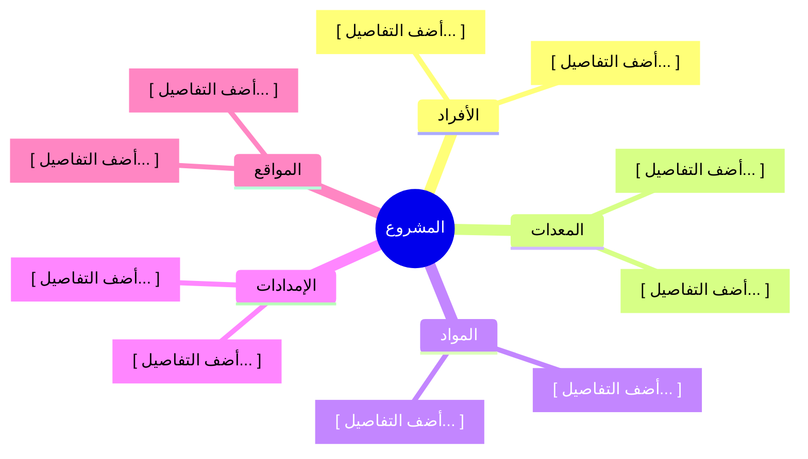

<!-- تعليمات للنموذج الذكي: قم بملء هيكل تجزئة الموارد بناءً على سياق المشروع.

السياق والتعريف:
هيكل تجزئة الموارد (RBS) هو هيكل هرمي يُستخدم لتنظيم الموارد حسب النوع والفئة. يمكن عرضه كمخطط هرمي أو كمخطط تفصيلي (Outline).
يمكن لهيكل تجزئة الموارد أن يتلقى المعلومات من:
*   سجل الافتراضات
*   خطة إدارة الموارد
*   الخط المرجعي للنطاق
*   خصائص الأنشطة

ويوفر المعلومات إلى:
*   ورقة عمل تقديرات المدة

هيكل تجزئة الموارد هو مُخرج من العملية 9.2 تقدير موارد الأنشطة في دليل PMBOK® - الإصدار السادس. تعتمد الموارد على نطاق المشروع. لذلك، إذا كان النطاق معروفاً ومستقراً، يجب أن تظل المتطلبات مستقرة نسبياً. أما إذا كان النطاق يتطور، فإن متطلبات الموارد ستتطور أيضاً.

نصائح التخصيص:
*   بالنسبة للمشاريع التي تحتوي على أنواع مختلفة ومتباينة من موارد الفريق، قد ترغب في تحليل فرع الفريق بشكل أكبر من خلال تضمين معلومات حول مستوى المهارة، الشهادات المطلوبة، الموقع، أو معلومات أخرى.
*   بالنسبة للمشاريع التي لها مواقع مختلفة، قد ترغب في تنظيم هيكل تجزئة الموارد حسب المنطقة الجغرافية.

المحاذاة:
يجب أن يكون هيكل تجزئة الموارد متوافقاً ومتسقاً مع الوثائق التالية:
*   خطة إدارة الموارد
*   متطلبات الموارد

تعليمات الأقسام:
*   **هيكل تجزئة الموارد (مخطط تفصيلي):** قم بتوفير مخطط هرمي للموارد منظماً حسب النوع والفئة. استخدم هيكل الترقيم التالي:
    1. المشروع
    1.1. الأفراد
        1.1.1. كمية الدور 1
            1.1.1.1. كمية المستوى 1
    1.2. المعدات
    1.3. المواد
    1.4. الإمدادات
    1.5. المواقع
*   **المخطط الهرمي:** قم بتوفير مخطط ذهني (Mermaid mindmap) أو مخطط انسيابي يمثل هيكل تجزئة الموارد بصرياً.
-->

<h3 align="left">{{اسم_الشركة}}</h3>
<h2 align="left">{{اسم_المشروع}} - {{معرف_المشروع}}</h2>
<h1 align="center">هيكل تجزئة الموارد</h1>

| **تاريخ الإعداد:** {{التاريخ_الحالي}} | **مدير المشروع:** {{اسم_مدير_المشروع}} | **إعداد:** {{معد_الوثيقة}} |
| ---: | ---: | ---: |  

---

### هيكل تجزئة الموارد (مخطط تفصيلي)
* 1. **[ اسم المشروع ]**
  * 1.1. **الأفراد**
    * 1.1.1. [ أضف التفاصيل... ]
    * 1.1.2. [ أضف التفاصيل... ]
  * 1.2. **المعدات**
    * 1.2.1. [ أضف التفاصيل... ]
    * 1.2.2. [ أضف التفاصيل... ]
  * 1.3. **المواد**
    * 1.3.1. [ أضف التفاصيل... ]
    * 1.3.2. [ أضف التفاصيل... ]
  * 1.4. **الإمدادات**
    * 1.4.1. [ أضف التفاصيل... ]
    * 1.4.2. [ أضف التفاصيل... ]
  * 1.5. **المواقع**
    * 1.5.1. [ أضف التفاصيل... ]
    * 1.5.2. [ أضف التفاصيل... ]

### هيكل تجزئة الموارد (المخطط الهرمي)

### التوقيعات

| تم الإعداد بواسطة: | تمت المراجعة بواسطة: | تم الاعتماد بواسطة: |
| ---: | ---: | ---: |
| **الاسم:** {{معد_الوثيقة}} | **الاسم:** {{مُراجع_الوثيقة}} | **الاسم:** {{معتمد_الوثيقة}} |
| **التوقيع:** _____________________ | **التوقيع:** _____________________ | **التوقيع:** _____________________ |
| **التاريخ:** _________________ | **التاريخ:** _________________ | **التاريخ:** _________________ |

---

  <strong>النموذج:</strong> هيكل تجزئة الموارد | <strong>المرجع:</strong> PMO-04.06.03  
  <i>تاريخ الإنشاء: {{وقت_الإنشاء}}, بواسطة <a href="https://github.com/fakhruldeen/Tasleemat/" style="color: #7f8c8d;">تسليمات</a></i>

