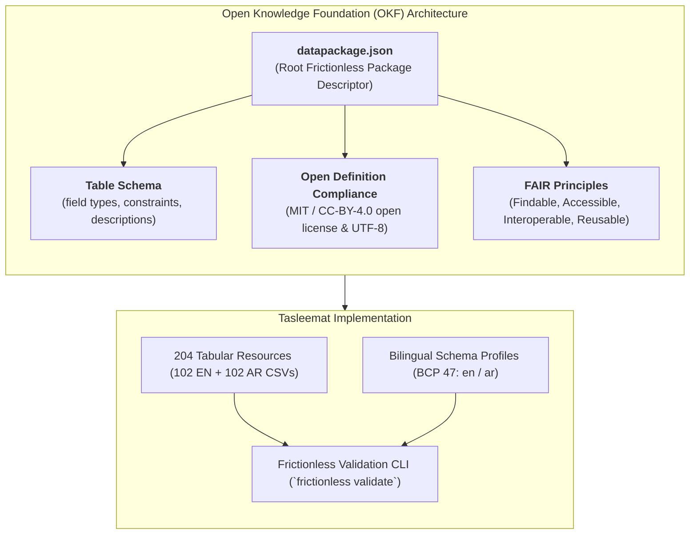
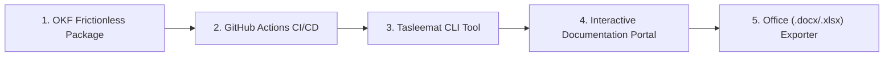

# Open Knowledge Foundation (OKF) Compliance & Repository Improvement Plan

## 1. Executive Summary

This document outlines the roadmap to elevate **Tasleemat** to meet the **Open Knowledge Foundation (OKF)** standards—specifically the **Frictionless Data Package Standard**—and implement transformative repository enhancements that make Tasleemat the definitive open, machine-readable, bilingual PMO framework globally.

---

## 2. What is OKF Format & Frictionless Data?

The **Open Knowledge Foundation (OKF)** establishes the global gold standard for open data interoperability, findability, and machine-readability.



---

## 3. Key OKF Implementation Components

### A. Root `datapackage.json` (Frictionless Data Package)
A unified, machine-readable manifest at the repository root describing the dataset according to the OKF Data Package standard:
- **Package Metadata**: `name: "tasleemat"`, `title: "Tasleemat Bilingual PMO Framework"`, `version: "2.0.0"`, `license: "MIT"`, `homepage`, `keywords`, `contributors`.
- **Resource Index**: Cataloging all 102 English CSVs and 102 Arabic CSVs as Frictionless Resources.
- **Table Schema (`tableschema`)**: Defining strict column data types (`Section: string`, `Field: string`, `Guidance: string`, `LLM_Generated_Value: string`).

### B. Table Schema Specification
```json
{
  "fields": [
    {
      "name": "Section",
      "type": "string",
      "description": "Lifecycle section or domain grouping within the PMO artifact.",
      "constraints": {"required": true}
    },
    {
      "name": "Field",
      "type": "string",
      "description": "Standardized field name or column header.",
      "constraints": {"required": true}
    },
    {
      "name": "Guidance",
      "type": "string",
      "description": "Practioner and LLM generation instruction for the field (min 25 chars).",
      "constraints": {"required": true, "minLength": 25}
    },
    {
      "name": "LLM_Generated_Value",
      "type": "string",
      "description": "Placeholder or generated value populated by user/AI agent.",
      "constraints": {"required": false}
    }
  ]
}
```

### C. Open Definition & FAIR Metadata
- Explicit **Open Definition** badge and metadata in `datapackage.json` and `README.md`.
- Explicit BCP 47 language indicators (`en` and `ar-SA`) and bidirectional orientation flags (`ltr` and `rtl`).

---

## 4. Key Repository Improvements Beyond OKF



### 1. GitHub Actions CI/CD Pipeline (`.github/workflows/ci.yml`)
Automate continuous verification on every pull request and push:
- Run `python3 tools/audit_forms.py` (204 forms structural sync).
- Run `python3 tools/check_rendering.py` (GitHub rendering verification).
- Run `frictionless validate datapackage.json` (OKF standard verification).

### 2. Tasleemat CLI & Python SDK (`tools/cli.py`)
Provide a practitioner CLI for rapid project scaffolding and AI integration:
```bash
# Initialize a new project with chosen methodology
tasleemat init my-project --methodology hybrid

# List all forms matching a search query
tasleemat search "risk"

# Generate or fill a form bundle
tasleemat fill PMO-03.01 --lang ar --context project_brief.txt

# Export a completed markdown template to styled DOCX or PDF
tasleemat export forms/en/.../03_01_Project_Charter_Template.md --to docx
```

### 3. Automated Office Document Generator (`tools/export_office.py`)
A batch tool to compile the Markdown templates and CSV datasets into styled `.docx` and `.xlsx` files with professional headers, typography, and company placeholders.

### 4. Interactive Bilingual Web Portal (GitHub Pages)
Leverage GitHub Pages / Jekyll navigation to provide:
- Live search by PMI process group, performance domain, or document code.
- Side-by-side bilingual comparison viewer (Arabic / English).
- 1-click Markdown copy and CSV download.

---

## 5. Phased Implementation Roadmap

| Phase | Milestone | Deliverables |
|:---|:---|:---|
| **Phase 1: OKF Standard Implementation** | Frictionless Packaging | Generate root `datapackage.json` with 204 resources + schema validation script. |
| **Phase 2: CI/CD Automation** | GitHub Actions Pipeline | Create `.github/workflows/ci.yml` with automated testing & linting. |
| **Phase 3: Tooling & CLI Suite** | Practitioner Tools | Build lightweight `tools/cli.py` for search, export, and scaffolding. |
| **Phase 4: Office Export Suite** | `.docx` & `.xlsx` Exporter | Add automated Markdown-to-Word / CSV-to-Excel export pipeline. |
| **Phase 5: Portal & Release 2.0** | Documentation & Release | Update README, release v2.0 package with OKF accreditation badges. |
