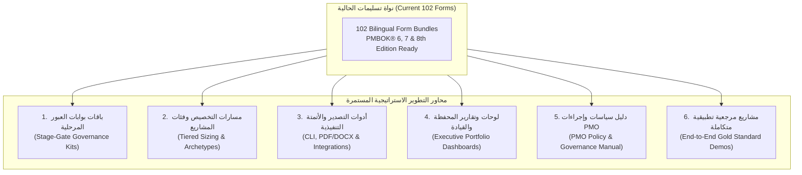

# 🚀 Tasleemat Strategic Roadmap & Future PMO Director Improvements
# خارطة الطريق الاستراتيجية ومقترحات التطوير المستقبلية (منظور مدير PMO)

**Document Reference:** `PMO-STRAT-FUTURE-PLANS`  
**Location:** `tools/future-plans.md` (Gitignored Internal Planning Asset)  
**Target Audience:** PMO Directors, EPMO Leaders, Enterprise Architects, AI Engineers  

---

## 🎯 Executive Vision: The PMO-in-a-Box Operating System
تتمثل الرؤية الاستراتيجية في نقل مستودع **«تسليمات»** من كونه **مكتبة نماذج شاملة (Asset Library)** إلى **نظام تشغيل حوكمي ومؤسسي متكامل لمكاتب إدارة المشاريع (PMO Operating System / PMO-in-a-Box)** قابل للاعتماد والتشغيل الفوري في الهيئات الحكومية، والبرامج الاستراتيجية (مثل برامج تحقيق رؤية 2030 والمشاريع الكبرى)، والشركات التقنية، وبيوت الخبرة الاستشارية.



---

## 🏛️ Strategic Pillars & Detailed Action Plans

### 1. باقات بوابات العبور المرحلية (Stage-Gate Governance Kits)
* **المفهوم:** تقسيم النماذج الـ 102 إلى حزم متوافقة مع بوابات الحوكمة المؤسسية، بحيث لا يُطلب من مدير المشروع التعامل مع النماذج دفعة واحدة، بل اجتياز بوابات محددة لتحرير ميزانية وموارد المرحلة التالية.
* **الباقات المقترحة:**
  * **بوابة 0 (دراسة الفكرة والجدوى - Gate 0: Concept & Business Justification):**
    * دراسة الجدوى وحالة الأعمال (`PMO-01.01`)
    * مصفوفة مواءمة الأهداف والنتائج الرئيسية OKRs (`PMO-00.06`)
    * نموذج حالة استخدام الذكاء الاصطناعي وتقييم الجاهزية (`PMO-02.04` / `PMO-02.03`)
  * **بوابة 1 (الاعتماد المؤسسي والبدء - Gate 1: Initiation & Authorization):**
    * ميثاق المشروع المعتمد (`PMO-03.01`)
    * سجل المعنيين الأولي (`PMO-03.04`)
    * سجل الافتراضات والقيود (`PMO-03.03`)
  * **بوابة 2 (اعتماد خط الأساس للتخطيط - Gate 2: Integrated Baseline Sign-off):**
    * خطة إدارة المشروع المتكاملة (`PMO-04.01.01`)
    * خطوط الأساس المعتمدة: بيان النطاق و WBS (`PMO-04.02.05` / `PMO-04.02.06`)، الجدول الزمني (`PMO-04.03.07`)، والتكلفة (`PMO-04.04.04`)
    * سجل المخاطر وخطة الاستجابة (`PMO-04.08.02` / `PMO-04.08.07`)
  * **بوابة 3 (المراجعات التشغيلية والتحكم - Gate 3: Operational Execution & Governance):**
    * تقرير حالة المشروع التنفيذي (`PMO-06.01`)
    * تحليل القيمة المكتسبة ومؤشرات التدفق (`PMO-06.05` / `PMO-06.12`)
    * سجلات المتابعة: المشكلات، القرارات، والتغييرات (`PMO-05.01`، `PMO-05.02`، `PMO-05.04`)
  * **بوابة 4 (القبول والجاهزية التشغيلية - Gate 4: Acceptance & Operational Handover):**
    * نموذج اعتماد اختبارات قبول المستخدم UAT (`PMO-06.10`)
    * نموذج القبول الرسمي للمنتج (`PMO-06.08`)
    * قائمة التحقق للانتقال إلى العمليات التشغيلية (`PMO-07.04`)
  * **بوابة 5 (الإغلاق المؤسسي وتحقيق المنافع - Gate 5: Formal Closeout & Benefits):**
    * وثيقة إغلاق المشروع الرسمية (`PMO-07.03`)
    * ملخص الدروس المستفادة والأصول المعرفية (`PMO-07.01`)
    * تقرير مراجعة ما بعد التنفيذ ومتابعة الفوائد (`PMO-07.05` / `PMO-01.03`)

---

### 2. تصنيف المشاريع ومسارات التخصيص السريع (Project Sizing & Tailoring Profiles)
* **المفهوم:** إنشاء مصفوفة تصنيف قياسية للمشاريع (Project Categorization & Tiering) تحدد الحد الأدنى الإلزامي من النماذج لكل فئة لتجنب البيروقراطية الزائدة في المشاريع البسيطة.
* **فئات المشاريع (Project Tiers):**
  * **الفئة (أ) - المشاريع الاستراتيجية والحرجة (Tier 1: Mega / High Complexity):**
    * الميزانية: > 10 ملايين ريال / فترة زمنية > سنة / مخاطر عالية.
    * نطاق الحوكمة: تطبيق 35–50 نموذجاً مع لجان توجيهية وتقارير أسبوعية/شهرية كاملة.
  * **الفئة (ب) - المشاريع المتوسطة والقياسية (Tier 2: Standard):**
    * الميزانية: 1–10 ملايين ريال / فترة زمنية 3–12 شهراً.
    * نطاق الحوكمة: حزمة من 18–25 نموذجاً تشمل خطوط الأساس وسجلات المخاطر والتغييرات والتقارير الشهرية.
  * **الفئة (ج) - المشاريع السريعة والخفيفة (Tier 3: Fast-Track / Lean):**
    * الميزانية: < 1 مليون ريال / فترة زمنية < 3 أشهر.
    * نطاق الحوكمة: حزمة خفيفة مدمجة (7–9 نماذج: ميثاق مبسط، Backlog/مهام، سجل مشكلات/قرارات مدمج، تقرير حالة موجز، قائمة تحقق إغلاق).
* **مسارات حسب طبيعة التسليم (Delivery Archetype Packs):**
  * **باقة المشاريع الرشيقة (Agile/Scrum Pack):** ميثاق الفريق، رؤية المنتج، تراكم المنتج، تخطيط السبرنت، مقاييس التدفق، مراجعة المرحلة (Retrospective).
  * **باقة المشاريع التنبؤية/الهندسية (Predictive/EPC Pack):** بيان العمل SOW، هيكل تجزئة العمل WBS، المسار الحرج، القيمة المكتسبة EVA، تدقيق الجودة والمشتريات.
  * **باقة منتجات الذكاء الاصطناعي والبيانات (AI/Data Product Pack):** نموذج حالة الاستخدام Canvas، تقييم الجاهزية والأخلاقيات، بطاقة النموذج Fact Sheet، سجل مكتبة الأوامر Prompts.

---

### 3. أدوات التصدير والأتمتة التنفيذية (Export Tooling & PM CLI)
* **المفهوم:** توفير أدوات سطر أوامر ونماذج تحويل لتسهيل التوليد الآلي للمستندات وتصديرها بصيغ مؤسسية رسمية.
* **الأدوات المستهدفة:**
  * **أداة سطر أوامر مخصصة (`tasleemat-cli`):**
    ```bash
    tasleemat generate --form PMO-03.01 --context project_brief.md --lang ar --output charter.md
    ```
  * **محرك تصدير للمستندات المؤسسية (Pandoc / Typst / Weasyprint Pipelines):**
    * تصدير قوالب Markdown إلى ملفات **PDF رسمية** ذات هوامش، ترويسات شعار المنظمة، وأرقام صفحات تلقائية، وجداول توقيعات معتمدة.
    * تصدير إلى ملفات **Word (.docx)** منسقة متوافقة مع قوالب الشركات والحكومة.
  * **التكامل مع أدوات إدارة المهام:**
    * سحب/دفع البيانات من وإلى أنظمة Jira، Microsoft Planner، ClickUp، و Monday.com.

---

### 4. لوحات وتقارير المحفظة والقيادة (Executive Steering Committee Dashboards)
* **المفهوم:** توفير نماذج مخصصة لعرض التقارير على مستوى الإدارة العليا واللجان التوجيهية بصورة بصرية وموجزة (One-Pager / Executive Slide Decks).
* **القوالب المقترحة:**
  * **العرض التقديمي للجنة التوجيهية (Steering Committee Executive Deck):** قالب Markdown متوافق مع Marp / RevealJS لإنشاء شرائح عرض تنفيذية دورية.
  * **لوحة المحفظة التجميعية (Portfolio Multi-Project Rollup Dashboard):** نموذج لتلخيص صحة 10–20 مشروعاً، والانحرافات في الميزانيات والجداول، والمخاطر الحرجة على مستوى المؤسسة.
  * **مصفوفة الاعتماديات الشاملة (Cross-Project Dependency Heatmap):** عرض بصري لترابطات المحفظة ونقاط الاختناق الحرجة.

---

### 5. دليل سياسات وإجراءات PMO المعتمد (PMO Policy Manual & Standard Operating Procedures)
* **المفهوم:** توفير وثيقة سياسات عليا (`PMO_POLICY_MANUAL.md`) تدعم النماذج وتحدد قواعد الحوكمة المؤسسية.
* **المحتويات الجوهرية:**
  * **سياسة التحكم في التغيير (Change Management Policy):** مصفوفة تفويض الصلاحيات وعتبات التغيير (مثل: التغييرات التي تزيد عن 10% من الميزانية أو أسبوعين من الجدول تتطلب موافقة مجلس الإدارة / اللجنة التوجيهية).
  * **سياسة إدارة النزاعات والتصعيد (Escalation & Dispute Matrix):** المستويات الزمنية والتنظيمية لتصعيد العوائق والمشكلات.
  * **سياسة التوثيق والأرشفة وإدارة المعرفة (Document Retention & Knowledge Management):** معايير حفظ سجلات المشاريع وحفظ الدروس المستفادة للأصول المؤسسية.

---

### 6. مشاريع مرجعية تطبيقية متكاملة (End-to-End Gold Standard Reference Demos)
* **المفهوم:** إنشاء مجلد `examples/` يضم مشاريع نموذجية وهمية معبأة بنسبة 100% لتكون مرجعاً تعليمياً للممارسين.
* **المشاريع النموذجية المستهدفة:**
  1. **مشروع تحول رقمي وذكاء اصطناعي (منهجية هجينة):** معبأ بالكامل من دراسة الجدوى حتى مراجعة ما بعد التنفيذ.
  2. **مشروع بنية تحتية أو إنشاءات ذكية (منهجية تنبؤية شلالية):** معبأ بكامل خطوط الأساس والمسار الحرج والقيمة المكتسبة.
  3. **مبادرة حوكمة وتغيير تنظيمي حكومي (رؤية 2030):** معبأة بنماذج إشراك المعنيين، خطة إدارة التغيير OCM، وتحقيق المنافع.

---

## 📈 Summary of Implementation Priorities (مصفوفة الأولويات التنفيذية)

| الأولوية | محور التطوير | القيمة المضافة | الجهد التقديري |
| :---: | :--- | :--- | :---: |
| **P1** | باقات بوابات العبور المرحلية (Stage-Gate Kits) | تحويل النماذج إلى مسارات حوكمة عملية ومباشرة | منخفض (أدلة وتنظيم) |
| **P1** | مصفوفة تصنيف المشاريع والتخصيص السريع (Tailoring Tiers) | تسهيل التبني وتفادي البيروقراطية في المشاريع الصغيرة | منخفض (مصفوفات وإرشادات) |
| **P2** | المشاريع المرجعية التطبيقية المعبأة (Examples Demos) | تدريب عملي فوري وإيضاح المعايير الذهبية للتعبئة | متوسط (بيانات ونماذج متكاملة) |
| **P2** | أدوات التصدير إلى PDF/Word و CLI Tooling | تمكين الاستخدام الميداني المباشر وإخراج وثائق رسمية | متوسط (برمجة سكربتات) |
| **P3** | لوحات المحفظة والعروض التقديمية التنفيذية | تلبية احتياجات الإدارة العليا واللجان التوجيهية | متوسط (قوالب بصرية) |
| **P3** | دليل سياسات وإجراءات PMO المعتمد (SOPs) | ترسيخ الحوكمة التنظيمية وربط النماذج بالسياسات | متوسط (صياغة حوكمية) |
